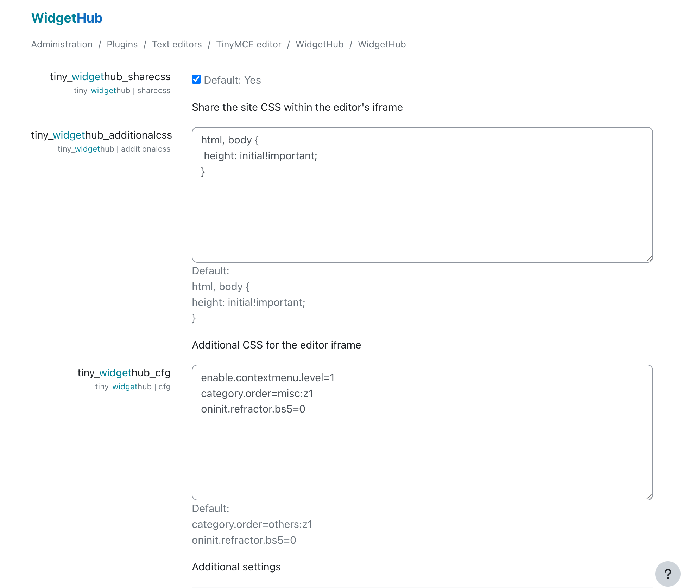

# WidgetHub

- Design, use and customize widget components seamlessly within the Tiny Editor.
- Use Bootstrap components easily.

> [!IMPORTANT]
> This plugin needs a Moodle theme based on Boost since some widgets rely on Bootstrap.

## Features

Users can:

1. Choose a widget.
2. Customize its appearance.
3. Insert it into the Tiny editor.

Later, at any time, the component can be reconfigured using context menus provided by the Tiny editor.


## Learn more

- [Examples: Learn how to customize and create widgets.](docs/examples.md)
- [Yaml API reference.](docs/api.md)

## Configuration

Administrators can manage widget definitions by customizing existing ones, creating new ones, or removing unwanted widgets. To access these options, simply type `widget` in the search field of the administrator area.

The options available are:



- **share_css**: When this checkbox is selected, all styles from the Moodle site will automatically be available within the editor's iFrame. Additional styles can be added via the administration page of your theme.


- **additionalcss**: If you prefer to keep the styles in the editor isolated from Moodle styles, add the desired styles in this textarea to make them available in the editor. URLs within comment blocks will automatically be translated into a CSS `link` tag in the editor iFrame.


- **cfg**: This allows additional configuration using the syntax `property=value`, with one configuration per line:  
  
  - *disable.plugin.pages*: A comma-separated list of body IDs for which the plugin will not be loaded.  

  - *enable.contextmenu.level*: Enable (`1`) or disable (`0`) context menus used by the plugin.

Feel free to share your widgets either by email `pep.mulet(at)gmail.com` or creating a pull request.

The capability 'tiny/widgethub:viewplugin' allows to set the plugin visibility for any role. Keep in mind that, by default, the role student is prevented from using the plugin.

 
 
## How to build

### Generate AMD modules

In order to generate the compiled code in `/amd/build` from sources in `/amd/src`, you need to execute the command

```
npx grunt amd
```

### Generate yalm editor dependency

Please refer to the documentation in libs/codemirror.


## Thanks

This plugin was originally inspired by the plugin [Snippet](https://moodle.org/plugins/atto_snippet) by Justin Hunt.

A version for the editor Atto of this plugin has been used in the institution [https://iedib.net/](IEDIB) since several years ago.
The modified version of this plugin, with the extensions and widgets used at IEDIB, is available at the the repository [IEDIB/moodle-tiny_widgethub](https://github.com/IEDIB/moodle-tiny_widgethub)


Icons by [Fontawesome 6.4](https://fontawesome.com/icons/file-code?f=classic&s=light).
