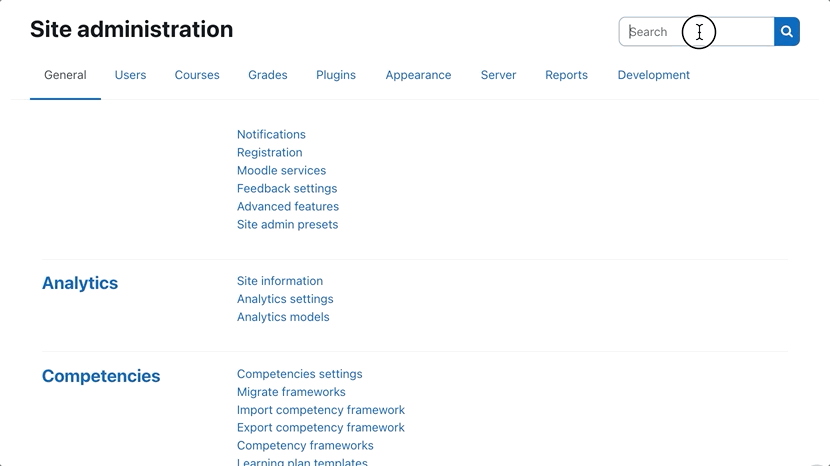

# WidgetHub

Design, use and customize widget components seamlessly within the Tiny Editor.

## Features

Users can:

1. Choose a widget.
2. Customize its appearance.
3. Insert it into the Tiny editor.

Later, at any time, the component can be reconfigured using context menus provided by the Tiny editor.


Administrators can customize existing widget definitions, create new ones, and remove unwanted widgets. Simply type
`widget` at the search field in the administrator area.



Feel free to share your widgets either by email `pep.mulet(at)gmail.com` or creating a pull request.

The capability 'tiny/widgethub:viewplugin' allows to set the plugin visibility for any role. Bear in mind that, by default, the role student is prevented from using the plugin.

## Learn more

- [Examples: Learn how to customize and create widgets.]('./docs/examples.md')
- [Yaml API reference.]('./docs/api.md')

## Generate AMD modules

In order to generate the compiled code in `/amd/build` from sources in `/amd/src`, you need to execute the command

```
npx grunt amd
```

## Generate codemirror dependency with extra toppings

Please refer to the documentation in libs/codemirror.


## Thanks

This plugin was originally inspired by the plugin [Snippet](https://moodle.org/plugins/tiny_snippet) by Justin Hunt.

A version for the editor Atto of this plugin has been used in the institution [https://iedib.net/](IEDIB) since five years ago.
The modified version for Tiny, with the extensions and widgets used at IEDIB, is available at the branch `master_iedib` of 
this repository.


Icons by [Fontawesome 6.4](https://fontawesome.com/icons/file-code?f=classic&s=light).
