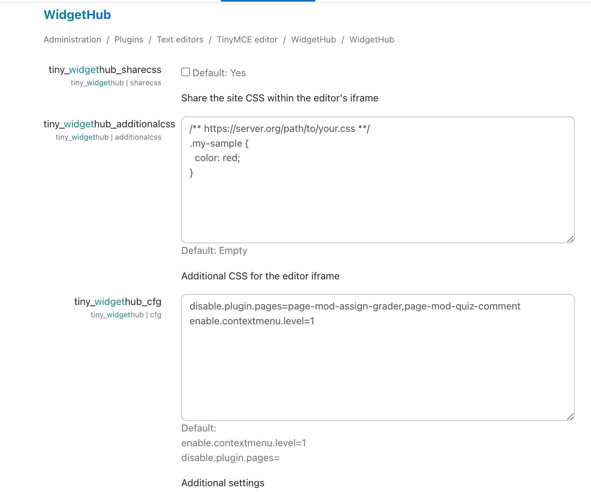

# WidgetHub

- Design, use and customize widget components seamlessly within the Tiny Editor.
- Use Bootstrap components easily.

> [!IMPORTANT]
> This plugin needs a Moodle theme based on Boost since some widgets rely on Bootstrap.

<div class="alert alert-info d-flex align-items-center" role="alert" style="gap: 0.5rem;">
   
  <div>
    <a href="https://chatgpt.com/g/g-68512f2f3ce4819182441c429f5b8673-widgethub-yml-builder"
       target="_blank" rel="noopener noreferrer" style="text-decoration: none; font-weight: 500; color: inherit;">
      Introducing <strong>WidgetHub GTP</strong> — your new assistant for building and inserting widgets effortlessly!
    </a>
  </div>
</div>

## Features

Users can:

1. Choose a widget.
2. Customize its appearance.
3. Insert it into the Tiny editor.

Later, at any time, the component can be reconfigured using context menus provided by the Tiny editor.


## Learn more

- [Examples: Learn how to customize and create widgets.](docs/examples.md)
- [Yaml API reference.](docs/api.md)
- [Known issues and workarounds.](docs/issues.md)

## Migration from Moodle 4x to Moodle 5.0

> [!IMPORTANT]
> To ensure Bootstrap components that rely on JavaScript function correctly in both Moodle 4.x and Moodle 5.0, we recommend using both `data-xxx` and `data-bs-xxx` attributes in your widget templates. While this makes the templates slightly more verbose, it eliminates the need for custom JavaScript to handle attribute differences.

For widgets already present on a page, you can automatically add the missing `data-bs-xxx` attributes. Refer to the `oninit.refractor.bs5` configuration option below for details.

## Configuration

Administrators can manage widget definitions by customizing existing ones, creating new ones, or removing unwanted widgets. To access these options, simply type `widget` in the search field of the administrator area.

The options available are:



- **share_css**: When this checkbox is selected, all styles from the Moodle site will automatically be available within the editor's iFrame. Additional styles can be added via the administration page of your theme.


- **additionalcss**: If you prefer to keep the styles in the editor isolated from Moodle styles, add the desired styles in this textarea to make them available in the editor. URLs within comment blocks will automatically be translated into a CSS `link` tag in the editor iFrame.


- **cfg**: This allows additional configuration using the syntax `property=value`, with one configuration per line:  
  
  - *disable.plugin.pages*: A **comma-separated** list of body IDs for which the plugin will not be loaded.  

  - *disable.plugin.pages.regex*: A **regular expression** that matches those body IDs for which the plugin will not be loaded.  

  - *enable.contextmenu.level*: Enable (`1`) or disable (`0`) context menus used by the plugin.

  - *category.order=misc:a1,deprecated:z1*: Overrides the default alphabetical category ordering. Provide a comma-separated string using the format `categoryName:sortingName`. The `sortingName` is used to determine the sort order among the listed categories. Categories not included in this list will maintain their default alphabetical order.

  - *oninit.refractor.bs5=0* - Enable (`1`) or disable (`0`) automatic refractoring of Bootstrap 5 `data-bs-xxx` attributes when the editor opens (default: 0).

  - *jsBaseUrl* - If specified, this **base URL** will be prepended to the `requires` property in the widget definition — *unless* `requires` already starts with `http`, in which case the base URL will be ignored. This feature is useful for dynamically changing the location of the JavaScript assets required by the widgets.

  - *tiny.iframe.jquery.version* The jQuery version that should be injected into the editor's iFrame. It defaults to "3.6.1" for Moodle 4.x and "none" for Moodle 5.x. The dependency is loaded from CDN and it should be available at: `https://code.jquery.com/jquery-${jqVersion}.min.js`

  - *tiny.iframe.jsbootstrap.version* The version of the javascript bundle of Bootstrap that should be injected into the editor's iFrame. It defaults to "4.6.2" for Moodle 4.x and "5.3.8" for Moodle 5.x. Please note that Bootstrap 4.x requires jQuery. The dependency is loaded from CDN and it should be available at: `https://cdn.jsdelivr.net/npm/bootstrap@${bsVersion}/dist/js/bootstrap.bundle.min.js`

**Insert Behavior Configuration**
 This section defines the general behavior configuration for all insert mechanisms in the plugin.

**Behavior Modes**
Each insert mechanism can be configured with one of the following modes:

| Mode | Description |
|------|--------------|
| **none** | Disables the insert mechanism entirely. |
| **default** | Inserts widget with default values. |
| **lastused** | Inserts widget using the last used values. |
| **ctrlclick** | Inserts widget with default values normally, and last used values when holding **Ctrl/Cmd** while clicking. |


- Configuration Options

  - **`insert.splitbutton.behavior=lastused`**  
    Controls the behavior of the *Split Button* in the TinyMCE toolbar.  
    **Options:** `none` | `default` | `lastused`

  - **`insert.recentlyused.behavior=lastused`**  
    Controls the behavior of the *Recently Used* badges displayed under the search text field.  
    **Options:** `none` | `default` | `lastused` | `ctrlclick`

  - **`insert.autocomplete.behavior=lastused`**  
    Controls the *Autocompletion* feature behavior.  
    **Options:** `none` | `default` | `lastused`

  - **`insert.autocomplete.symbol=@`**  
    Defines the symbol that triggers the autocompletion menu.  
    This option has no effect if `insert.autocomplete.behavior=none`.

  - **`insert.quickbutton.behavior=ctrlclick`**  
    Controls the behavior of the *Quick Button* (that with a ray icon) next to the main widget button.  
    **Options:** `none` | `default` | `lastused` | `ctrlclick`

The capability 'tiny/widgethub:viewplugin' allows to set the plugin visibility for any role. Keep in mind that, by default, the role student is prevented from using the plugin.

 
 
## How to build

### Generate AMD modules

In order to generate the compiled code in `/amd/build` from sources in `/amd/src`, you need to execute the command

```
npx grunt amd
```

### Generate yalm editor dependency

Please refer to the documentation in libs/codemirror.


## Thanks

This plugin was originally inspired by the plugin [Snippet](https://moodle.org/plugins/atto_snippet) by Justin Hunt.

A version for the editor Atto of this plugin has been used in the institution [https://iedib.net/](IEDIB) since several years ago.
The modified version of this plugin, with the extensions and widgets used at IEDIB, is available at the the repository [IEDIB/moodle-tiny_widgethub](https://github.com/IEDIB/moodle-tiny_widgethub)


Icons by [Fontawesome 6.4](https://fontawesome.com/icons/file-code?f=classic&s=light).
