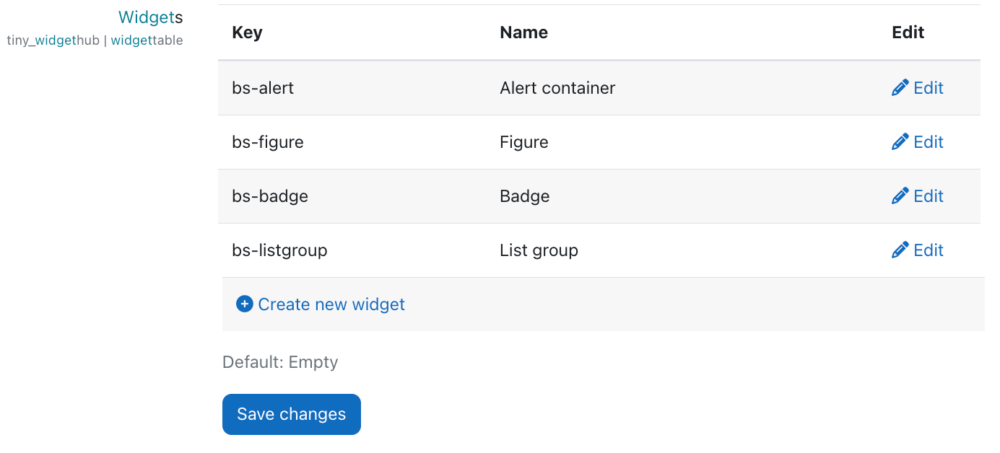
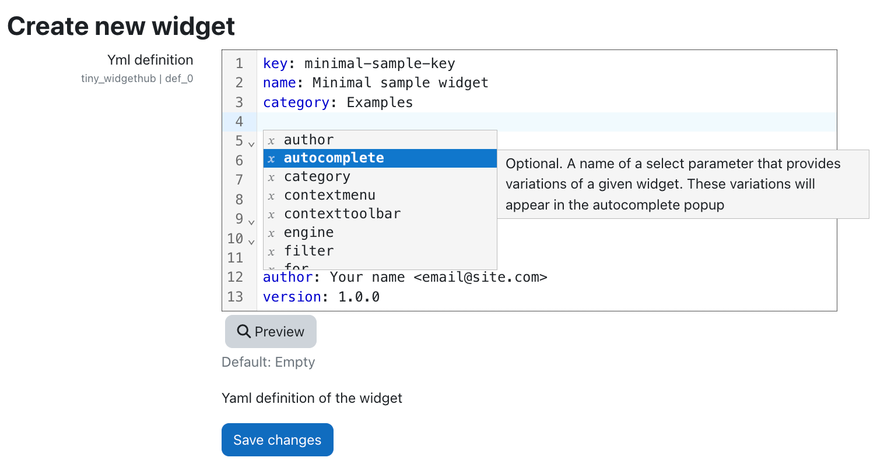
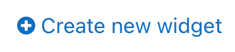
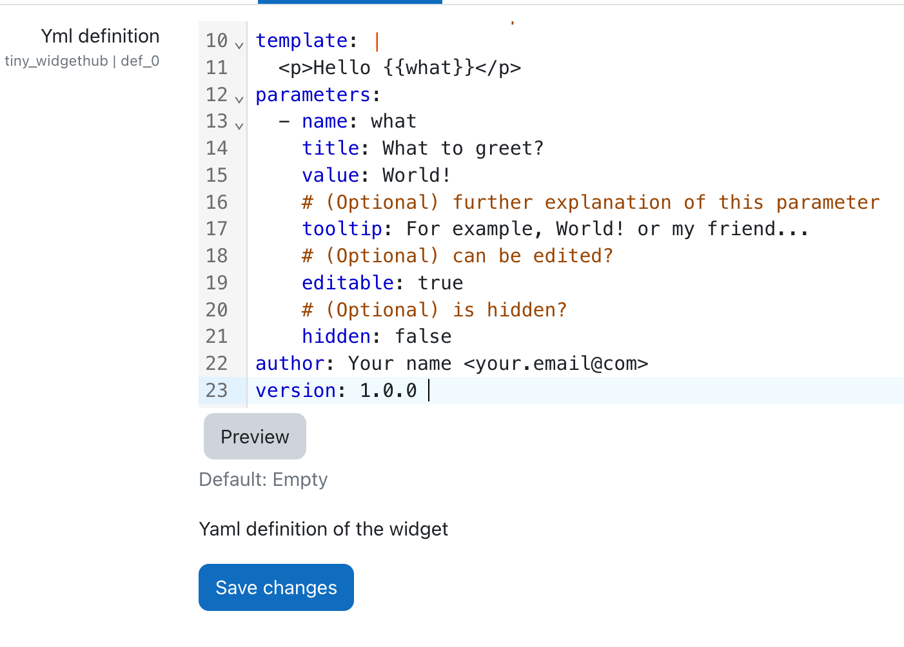
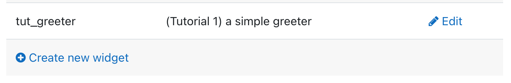

# WidgetHub. Creating widgets

The following sections will walk through the process of creating new widgets by using the yaml syntax.
We shall start with a basic example and, progressively, we will continue showing more advanced cases.

## Administration options

To access the plugin's administration options, type `widget` in the search field of the administration area. Then, scroll down until you see the widget table:



- **To create a new widget**: Click the **plus (+)** button.  
- **To edit an existing widget**: Click the **edit** button to view and customize its definition.

When you open the editor, a new page with a YAML editor will appear. Use Ctrl+Space to access autocompletion hints for easier editing.

To preview the widget's appearance and check for potential errors, click the Preview button. Once you're satisfied with the result, save your changes by clicking the Save button.

If you're editing an existing widget, you'll also see a Delete button, which allows you to remove the widget entirely. Alternatively, if you want to temporarily hide the widget without deleting it, set the property `hidden: true` in the YAML setting.




## Dealing with styles

As a general rule, avoid using inline styles. Instead, replace them with CSS classes for better maintainability and consistency. While defining new classes can sometimes feel cumbersome, leveraging the existing utility classes provided by Bootstrap is an effective strategy. However, there will inevitably be situations where creating custom classes is necessary. But where should you place these new classes?

Keep in mind that the Tiny editor runs within an iframe, meaning the CSS on the Moodle page does not directly affect the editor's styles. To customize the editor's appearance, follow these steps:

Add your custom CSS to the "Additional Raw CSS" section of your theme settings.

Navigate to the WidgetHub administration page, where you have two options for applying the styles:

**Option 1**:
Enable the Share styles checkbox. This will make all styles from Moodle automatically available in the editor.

**Option 2**:
Copy your custom CSS into the provided textarea. These styles will be injected directly into the editor's iframe. If your styles are extensive, consider linking to an external file. URLs written within comments (e.g., /** https://domain.org/location/to/your/file.css **/) will be converted into a ```<link>``` tags automatically.

## Example 1. A basic example

The basic contents of a yaml file defining a widget are 

````yml
# An unique identifier
key: tut_greeter
name: (Tutorial 1) a simple greeter
category: tutorials
instructions: (Optional) A detail explanation
# (Optional) defaults to 'mustache' although you can also use 'ejs' depending on the type of template used
engine: mustache
# Write your HTML with or without parameters. In mustache, parameters are written within double brakets {{..}}
# Therefore what is a parameter that we must define below
template: |
  <p>Hello {{what}}</p>
parameters:
  - name: what
    title: What to greet?
    value: World!
    # (Optional) further explanation of this parameter
    tooltip: For example, World! or my friend...
    # (Optional) can be edited?
    editable: true
    # (Optional) is hidden?
    hidden: false
author: Your name <your.email@domain.com>
version: 1.0.0 
````

To use it, you have to register this widget into your Moodle instance. Go to administration settings and search 'widget'. The search result will be under the URL /admin/category.php?category=tiny_widgethub

Click on the link 


Paste the yaml code above into the Yaml Editor 

 

and press the button Save changes. You will see the brand new widget registered.



Now open a Moodle activity that uses the tiny editor and click on the WidgetHub button. You should see a dialog with a section named "TUTORIALS" and a widget button within. Click on the (Tutorial 1) button.


Since the widget contains parameters, a second modal dialog appears with a form to modify the template parameters.


Click on the "Accept" button and you the result will appear in the Tiny editor


### Example 2. Conditionals in templates

In this example we will create a widget that conditionally sets a bold style to the text passed as parameter

````yml
# An unique identifier
key: tut_conditionals1
name: (Tutorial 2) conditionals in templates
category: tutorials
template: |
  <p{{#useBold}} style="font-weight: bold"{{/useBold}}>{{txt}}</p>
parameters:
  - name: txt
    title: Your text
    value: Lorem ipsum
  - name: useBold
    title: should text be in bold face?
    value: true
author: Your name <your.email@domain.com>
version: 1.0.0 
````

For more information, [this reference](https://www.elated.com/res/File/articles/development/easy-html-templates-with-mustache/sections-conditional.html) explain how to conditionally render parts of the Mustache template.

### Example 3. Select options in templates

What about choosing a class from a list of options? Let's do it!

````yml
# An unique identifier
key: tut_select1
name: (Tutorial 3) list of options
category: tutorials
template: |
  <p><span class="badge bg-{{severity}}">Content</span></p>
parameters:
  - name: severity
    title: Type of badge
    # by default takes the first option
    value: primary
    options:
      - primary
      - success
      - warning
      # You may want to use a custom label and value
      - {l: 'Be careful', v: 'danger'}
author: Your name <your.email@domain.com>
version: 1.0.0 
````

You can show or hide certain parameters in the form depending on the values of other parameters. For that purpose, we use the keyword `when` to tell when the parameter must be rendered.

Assume that we want to decide whether use a badge or not, and if so, choose among one type.

````yml
key: tut_select1
name: (Tutorial 3) list of options
category: tutorials
template: |
  <p><span{{#useBadge}} class="badge bg-{{severity}}"{{/useBadge}}>Content</span></p>
parameters:
  - name: useBadge
    title: Do you want to display a badge?
    value: true
  - name: severity
    title: Type of badge
    value: primary
    # When to render this control?
    when: useBadge === true
    options:
      - primary
      - success
      - warning
      - {l: 'Be careful', v: 'danger'}
author: Your name <your.email@domain.com>
version: 1.1.0 
````

### Example 4. Using loops in the template

Since mustache is a logic free template system, some features are difficult to achieve. To overcome this limitation, you can use [`ejs`](https://ejs.co/) as an alternative template system. As you will see, it provides more flexibility. 

Let's assume that we want to create a table of `n` rows and `m` columns. That's the way we do it


````yml
key: tut_loops1
name: (Tutorial 4) loops1
category: tutorials
engine: ejs
template: |
  <p></p>
  <table class="table table-striped">
  <thead>
    <tr>
        <% for(let j=1; j<=m; j++) { %>
            <th> Title {{j}} </th>
        <% } %>
    </tr>
  </thead>
  <tbody>
   <% for(let i=1; i<=n; i++) {%>
    <tr>
        <% for(let j=1; j<=m; j++) { %>
            <td> Item <%= i%> - <%= j%> </td>
        <% } %>
    </tr>
    <% } %>
  <tbody>
  </table>
  <p></p>
parameters:
  - name: n
    title: Number of rows
    value: 5
    min: 1
  - name: m
    title: Number of columns
    value: 3
    min: 1
author: Your name <your.email@domain.com>
version: 1.1.0 
````


You can even use it with cases that you are using other markup than HTML. For instance, image that you want a shortcut to insert a matrix in Mathjax. 

````yml
key: tut_loops2
name: (Tutorial 4) loops2
category: tutorials
engine: ejs
# As you can see we can use the ternary operator in JavaScript
# to simplify an if statement: j===1 ? '' : ' & '
template: |
  <p></p>
  \[A=\(\begin{matrix} 
    <% for(let i=1; i<=n; i++) { %>
        <% for(let j=1; j<=m; j++) { %>
          <%= j===1 ? '' : ' & ' %> 
           a_{<%= i%>,<%= j%>}
        <% } %>  \\
    <% } %>
    \end{matrix}\)\]
  <p></p>
parameters:
  - name: n
    title: Number of rows
    value: 5
    min: 1
  - name: m
    title: Number of columns
    value: 3
    min: 1
author: Your name <your.email@domain.com>
version: 1.1.0 
````

Nevertheless, the WidgetHub plugin adds some custom blocks to Mustache template rendering engine in order to implement basic loops.

TODO check API [k=b] or [k,a,b]
`````
{{#each}}[k,1,4]{{k}}{{/each}}
`````
will print 1234.

### Example 5. Widgets that require id's

For every id that you need, create a parameter visibility hidden and having the special value `$RND` to ensure that every instance will have a different id.

````yml
parameters:
  - name: id1
    value: $RND
    hidden: true
````


### Example 6. Introduction to bindings

After you have inserted a widget into the editor you may want to edit it. This is achieved through the context menus and context toolbars that are provided by the Tiny editor API. Therefore, in this example we will see how to enable one of these context menus.

Before start

Let's start be modifying the example 3

````yml
key: tut_select2
name: (Tutorial 3) list of options with context menu
category: tutorials
template: |
  <p><span class="badge bg-{{severity}}">Content</span></p>
parameters:
  - name: severity
    title: Type of badge
    options:
      - primary
      - success
      - warning
      - danger
    # Here comes the new keyword!
    bind: classRegex('bg-(.*)')
# And you must tell how to identify this widget with a query selector
# This is regarded as the root of the component
selectors: 'span.badge'
# You may also want to unwrap the component, i.e., in this 
# example means that the span is replaced by all '*' its contents
unwrap: '*'
author: Your name <your.email@domain.com>
version: 1.0.0 
````

Other bind functions available are:

- `hasClass(className: string, query?: string): boolean` - Returns true if the node has the class or classes passed in the first argument. The second argument is optional and it allows to look for the class in a HTML node diferent than the widget root (defined by the keyword selectors).

````
HTML: <p class="widget1"><span class="badge bg-info">Content</span></p>
Selector: .widget1 
Binding: hasClass('badge', 'span') is true
````

- `notHasClass(className: string, query?: string): boolean` - The same as the previous function but produces a negated result.

- `classRegex(classExpr: string, castTo?: string, query?: string): string | boolean | number` - Extracts a part of the class property of the element that maches the classExpr. Optionally the result can be cast to types (`boolean`, `number`, `string`).


- `hasAttr(attrName: string, query?: string): boolean` - Returns true if the HTML element has an attribute named attrName. If the attrName has the following syntax name=value, then returns true if the element has an atribute named name with value value.

````
HTML: <p><span class="badge" data-animate="true">Content</span></p>
Selector: span.badge 
Binding: hasAttr('data-animate=true', 'boolean') is true
````

- `hasAttr(attrName: string, query?: string): boolean` - Negated version of the previous function

- `attr(attrName: string, castTo?: string, query?: string): string | boolean | number` - Returns the value of an attribute named attrName

````
HTML: <p><span class="badge" data-type="info">Content</span></p>
Selector: span.badge 
Binding: attr('data-type') is info
````

-  `attrRegex(attrExpr: string, castTo?: string, query?: string): string | boolean | number` - attrExpr has the form attrName=attrValueRegex. Therefore this function extracts a part of the value of an atributed named attrName.

````
HTML: <p><span class="badge" data-type="info-4">Content</span></p>
Selector: span.badge 
Binding: attrRegex('data-type=info-(.*)', 'number') is 4
````

- `hasStyle(sty: string, query?: string): boolean` - Looks if the sytle property has the key sty set.

````
HTML: <p><span class="badge" style="font-size: 14px;">Content</span></p>
Selector: span.badge 
Binding: hasStyle('font-size') is true, but hasStyle('color') is false.
````

- `notHasStyle(sty: string, query?: string): boolean` - The negated version of the previous function.

These functions may be suitable for most of the cases, but, in some ocassions there might be situacions that are not enough. In these cases, the widget dessigner can provide its own logic using plain javascript. The syntax is

````yaml
binding:
  get: ($e) => /* return whatever you need from the jQuery element $e */
  set: ($e, v) => /* update all you need of the element $e with the new value v */
````

For example, let's see how to hasClass function might be implemented using this API

````yaml
# Example of how hasClass can be simulated (assuming that the root is in the p element)
binding:
  get: ($e) => $e.find('span').hasClass('badge')
  set: |
      ($e, v) => {
        v ? $e.addClass('badge') : $e.removeClass('badge')    
      }
````